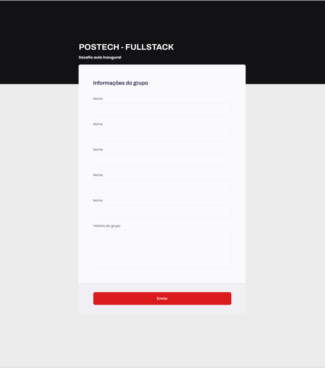

# Desafio FSDT

**DESAFIO**

Criar formulário seguindo mockup do 



1. **As informações deverão ser enviadas por uma requisição POST para: [https://fsdt-contact.onrender.com](https://fsdt-contact.onrender.com/)[/contact](https://fsdt-contact-acf4ab9867a7.herokuapp.com/contact) as informações devem ser enviadas no formato JSON.**
2. **O JSON deve conter um atributo names (um array de string contendo os nomes dos integrantes da equipe) e um atributo message (uma string que referencia o campo história do grupo do protótipo)**
3. **Após enviar o formulário em caso de sucesso é necessário limpar os campos do formulário(Não pode simplesmente dar um reload na página) e também exibir um alert informando que foi enviado com sucesso**
4. **Em caso de erro é necessário mostrar um alert informando que ocorreu um erro**
5. **Após a finalização, disponibilize no GitHub e enviar o link do repo no chat bate-papo do discord para avaliação**

```jsx
POST
https://fsdt-contact.onrender.com/contact

{
    "names": [
        "Gustavo",
        "Vanderson",
        "Henrique",
        "Thiago"
    ],
    "message": "Oi pessoal, sou o Gustavo, e sou o coordenador no curso de Full Stack! …"
}

```

1. Caso tenham dúvidas publicar no chat do discord para já irmos nos adaptando com o fórum 


Link para acessar discord

- Acessar o link https://postech.fiap.com.br/aula-inaugural/discord
- turma 6FSDT
- grupo 22

**REGRAS**

- Permitido apenas a utilização de HTML, CSS e JavaScript. **Não é permitido** a utilização de frameworks ou bibliotecas e os arquivos de CSS e JavaScript devem estar separados do HTML.
    - Ex de estrutura de pastas:
        - folder
            - index.html
            - style.css
            - script.js
- Tempo máximo de 45 min